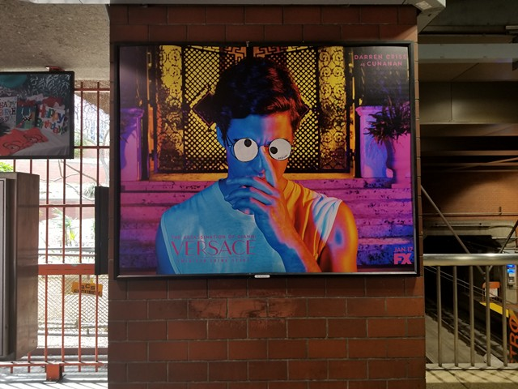

## Portrait of the Artist as a Not Totally Useless Activist
###### re: On Art, Design, and Activism

> I am committed to the political project of imagining how to detach from lives that don't work
> and from worlds that negate the subjects that produce them; and I aim, along with many anti normative activists, to expand the field
> of affective potentialities, latent and explicit fantasies, and infrastructures for how to live beyond survival,
> *toward flourishing not later but in the ongoing now.*  -Lee Edelman, *Sex, or The Unbearable* [emph mine]

> I want freedom, the right to self-expression, everybody's right to beautiful, radiant things.
> -Emma Goldman, *Living My Life*

> If what you want is jobs  
> for everyone, you are still the enemy,  
> you have not thought thru, clearly  
> what that means
>
> ...remeber  
> you can have what you ask for, ask for  
> everything.      -Diane di Prima, Revolutionary Letter #19

I paste these three quotes here as a sort of reflex response and a reminder that whatever theory hole I dig myself into, ultimatly I believe in art to celebrate or grapple with ourselves now and to imagine our futures. Its role in getting us from here to there I think is what gets complicated.

In the Groys essay he adresses that "Art activists do want to be useful" but "In our society, art is traditionally seen as useless." This alone is its own hurdle both for art and for our well-being. I certainly get in a mood walking by gallery after gallery of big brushstroke color abstractions priced to hang above Italian leather sofas, but just because you eat a bad overpriced airport sandwich one day doesn't disqualify them all as "food." I think maybe art is a kind of food--so even if there's junk art, fast art, whatever, at its root I acknowledge necessity. (For the sake of simplicity I'm using a very loose idea of "art" as most kinds of created human expression) [Appreciating the "uselessness" of art](http://www.hamptoninstitution.org/activism-or-revolution.html#.WrAsP2bMwWq) is already contrary to contemporary capitalist idealogies of productivity and utility, perhaps (re)spawned from America's puritanical past, and activists would do well to keep that in mind (the pressure to burn bright until you burn out also being very real in radical communities). Not that art alone can be enough, but no one thinks Food Not Bombs is useless because it's only doing one thing. As individuals we can only do so many things, and I frequently feel guilty about counting art as one of the "things" I want to do, but if I would value someone else doing that work I should value it in myself.

There's no doubt art can provoke a reaction, and thinking about the Piper piece sometimes a very personal reaction can be a necessary step in self examination and change. And activism (or at least mine) in some part hinges on the belief that people can change. Going about this isn't straightforward though; when I brought this topic up a friend brought up the Dana Schutz's Whitney Biennial debacle. Many people were upset about a white artist depicting "Black Death Spectacle" (a response from artist Parker Bright), especially in a time where the media is saturated with brutal images of violence towards black and brown bodies in a way it never depicts white ones. At the same time, using a "classical" medium like painting and the privledge of showing in a space frequented by wealthy white folks to force people to confront a long history of American racism is in some ways what an ally is "supposed" to do--white folks fixing white folks (this of course hinges on the spectre of empathy/concience, which as Stokely Carmichael notes "the United States has none," but that's another complex issue). I think both takes can make sense, and that heteroglossia itself is good. Can activism be accomplished through institutional means is another mosquito in the room, and another question I don't have a real answer to. The effectivness and role of activist tactics besides art--[from black block to sanctionod marches](https://mic.com/articles/166720/blm-co-founder-protesting-isnt-about-who-can-be-the-most-radical-its-about-winning#.wHdgjC6B9)--is not agreed upon either, so singling out art I think often goes back to the guilt we might feel about having nice things.

I sort of like Groy's explanation that "Design wants to change reality, the status quo—it wants to improve reality, to make it more attractive, better to use. Art seems to accept reality as it is, to accept the status quo. But art accepts the status quo as dysfunctional, as already failed." It sounds nice anyway, though more art history knowledge on my part would probably help in grappling with it. It makes me think of poster *design*, obvious activist art, vs. maybe glitch *art*, a exploitation of technological shortcomings. We do need to aestheticize an imagined better future to make it appealing & to reassure ourselves, and we also need to enjoy exploring and poking holes in the present.

